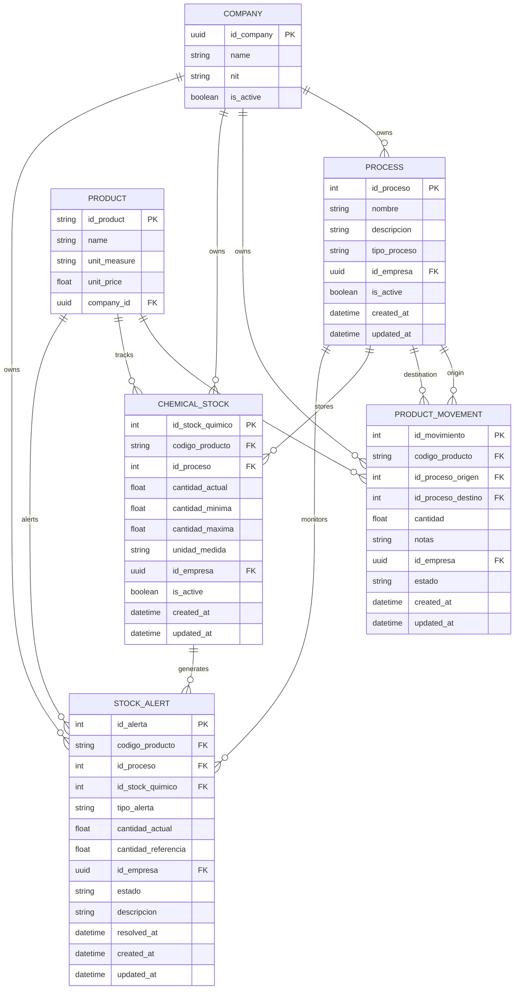
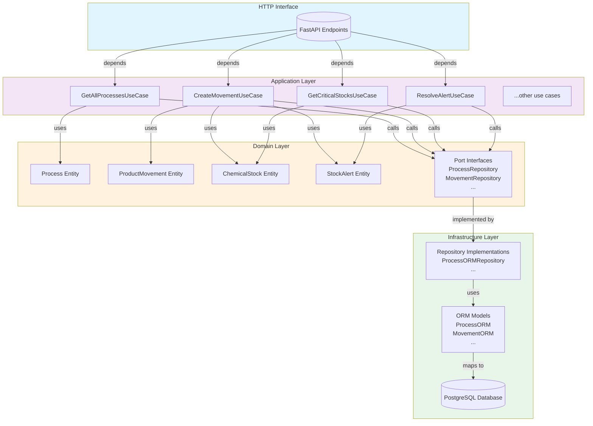
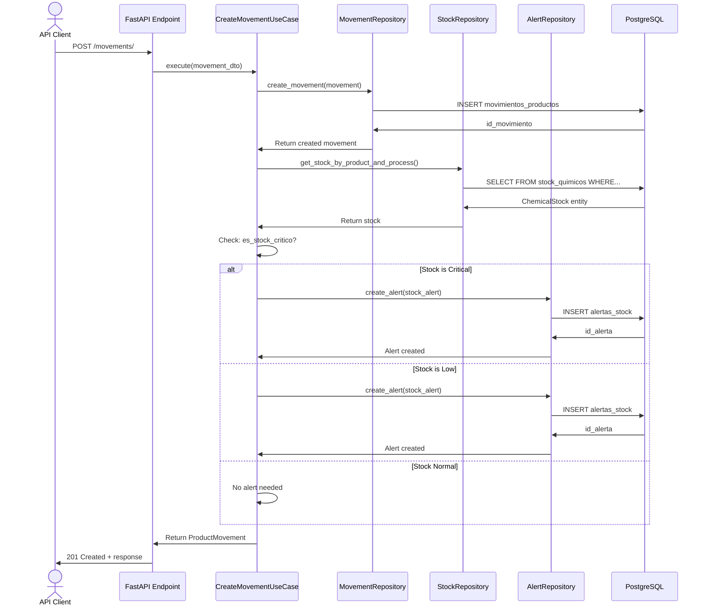
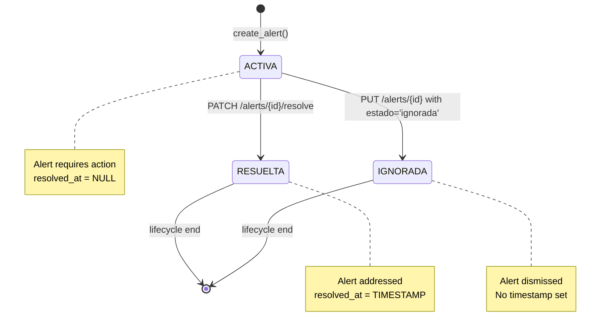
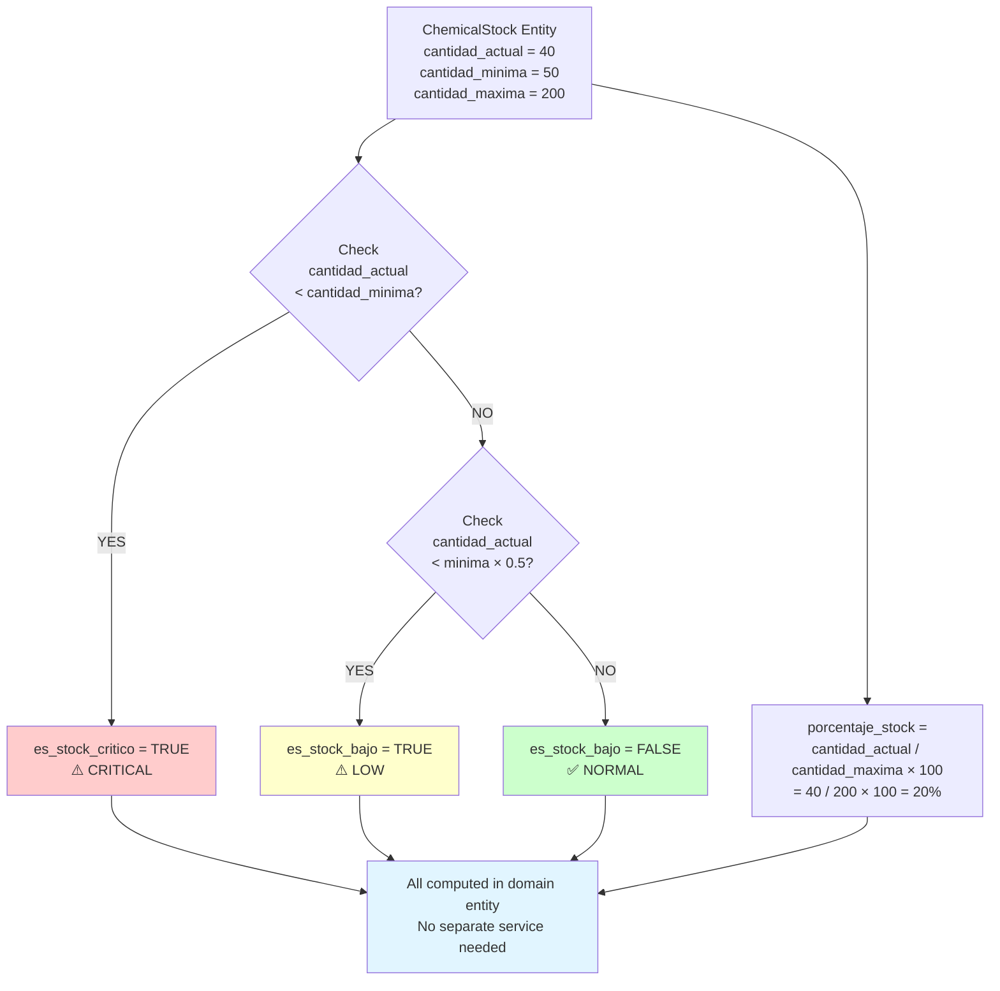
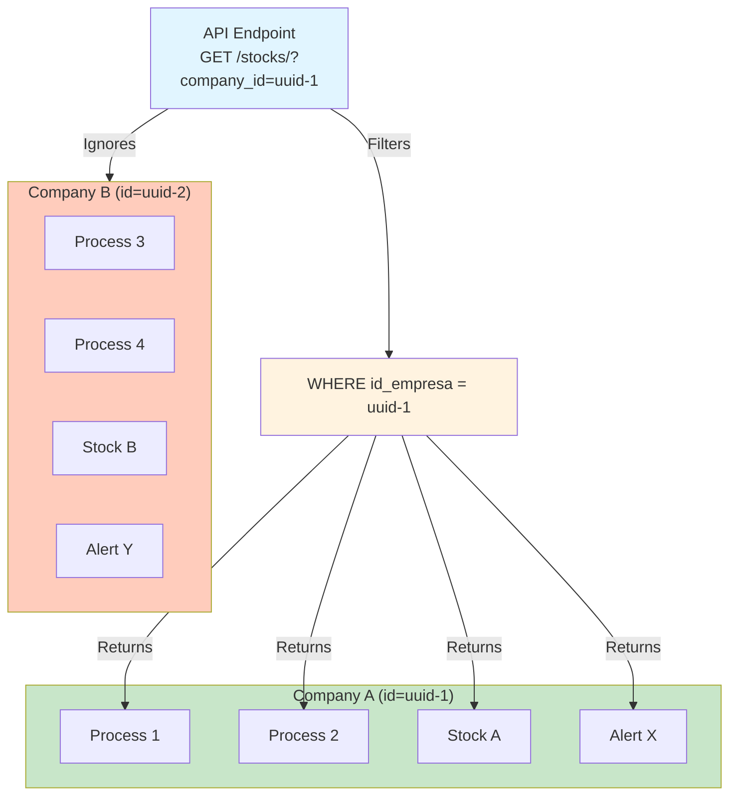

# SYSTEM ARCHITECTURE DIAGRAMS

## Entity Relationship Diagram



## Hexagonal Architecture Layers



## ProductMovement with Alert Generation Flow



## Alert Lifecycle State Machine



## Stock Status Computation



## API Request Flow

```mermaid
graph LR
    Client["Client"]
    
    Client -->|HTTP Request| Router["FastAPI Router<br/>e.g., /processes/"]
    
    Router -->|Depends| Deps["Dependency Injection<br/>get_get_process_use_case"]
    
    Deps -->|Creates| UseCase["Use Case Instance<br/>GetProcessByIdUseCase"]
    
    UseCase -->|Calls| Entity["Domain Entity<br/>business logic"]
    
    UseCase -->|Calls| Port["Port Interface<br/>ProcessRepository.get_process_by_id"]
    
    Port -->|Implemented by| Repo["Repository Implementation<br/>ProcessORMRepository"]
    
    Repo -->|Uses| ORM["ORM Model<br/>ProcessORM"]
    
    ORM -->|Queries| DB["PostgreSQL Database"]
    
    DB -->|Returns rows| ORM
    ORM -->|Converts| Entity
    Entity -->|Returns to| UseCase
    UseCase -->|Returns to| Router
    Router -->|HTTP Response| Client["Client<br/>JSON Response"]
    
    style Client fill:#fff9c4
    style Router fill:#e1f5ff
    style Deps fill:#f3e5f5
    style UseCase fill:#f3e5f5
    style Entity fill:#fff3e0
    style Port fill:#fff3e0
    style Repo fill:#e8f5e9
    style ORM fill:#e8f5e9
    style DB fill:#e8f5e9
```



## Multi-Tenant Data Isolation



## Database Schema Structure

```
procesos (processes)
├── id_proceso (PK)
├── nombre
├── tipo_proceso (ENUM: produccion, prestamo, almacenamiento, descarte)
└── id_empresa (FK → companies)

movimientos_productos (product movements)
├── id_movimiento (PK)
├── codigo_producto (FK → products)
├── id_proceso_origen (FK → procesos)
├── id_proceso_destino (FK → procesos)
├── estado (ENUM: pendiente, en_transito, completado, cancelado)
└── id_empresa (FK → companies)

stock_quimicos (chemical stocks)
├── id_stock_quimico (PK)
├── codigo_producto (FK → products)
├── id_proceso (FK → procesos)
├── cantidad_actual, cantidad_minima, cantidad_maxima
└── id_empresa (FK → companies)

alertas_stock (stock alerts)
├── id_alerta (PK)
├── codigo_producto (FK → products)
├── id_proceso (FK → procesos)
├── id_stock_quimico (FK → stock_quimicos)
├── tipo_alerta (ENUM: stock_critico, stock_bajo, exceso)
├── estado (ENUM: activa, resuelta, ignorada)
├── resolved_at (NULLABLE timestamp)
└── id_empresa (FK → companies)
```
